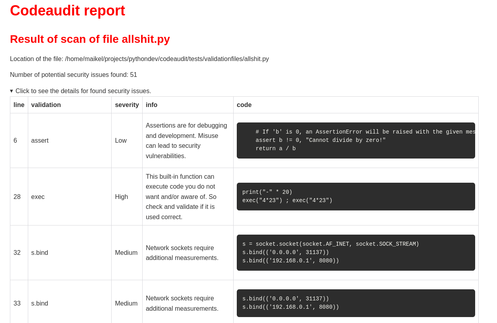

# Codeaudit


[](https://pypi.org/project/codeaudit)
[](https://pypi.org/project/codeaudit)
[](https://www.bestpractices.dev/projects/10970)
[](https://pepy.tech/projects/codeaudit)

Python Code Audit - A modern Python source code analyzer based on distrust.

Python Code Audit is a tool to find **security issues** in Python code. This static application security testing (SAST) tool has **great** features to simplify the necessary security tasks and make it fun and easy. 

This tool is designed for anyone who uses or creates Python programs and wants to understand and mitigate potential security risks.

This tool is created for:
* Python Users who want to assess the security risks in the Python code they use.
* Python Developers: Anyone, from professionals to hobbyists, who wants to deliver secure Python code.
* Security-Conscious Users: People seeking a simple, fast way to gain insight into potential security vulnerabilities within Python packages or files.

Creating secure software can be challenging. This tool, with its comprehensive [documentation](https://nocomplexity.com/documents/codeaudit/intro.html), acts as your helpful security colleague, making it easier to identify and address vulnerabilities.

## Features

Python Code Audit has the following features:

* **Vulnerability Detection**: Identifies security vulnerabilities in Python files, essential for package security research.

* **Complexity & Statistics**: Reports security-relevant complexity using a fast, lightweight [cyclomatic complexity](https://en.wikipedia.org/wiki/Cyclomatic_complexity) count via Python's AST.

* **Module Usage & External Vulnerabilities**: Detects used modules and reports known vulnerabilities for used external modules.

* **Inline Issue Reporting**: Shows potential security issues with line numbers and code snippets.

* **HTML Reports**: All output is saved in simple, static HTML reports viewable in any browser.


> [!IMPORTANT]
> Python Code Audit uses the Python's Abstract Syntax Tree (AST) to get robust and reliable result. Using the Python AST makes contextual Vulnerability Detection possible and false positive are minimized.


## Installation

```console
pip install codeaudit
```

or use:

```bash
pip install -U codeaudit
```

If you have installed Python `codeaudit` in the past and want to make sure you use the latest new validations and features.

## Usage

After installation you can get an overview of all implemented commands. Just type in your terminal:

```text
codeaudit
```

This will show all commands:

```text
----------------------------------------------------
 _                    __             _             
|_) \/_|_|_  _ __    /   _  _| _    |_|    _| o _|_
|   /  |_| |(_)| |   \__(_)(_|(/_   | ||_|(_| |  |_
----------------------------------------------------

Python Code Audit - A modern Python security source code analyzer based on distrust.

Commands to evaluate Python source code:
Usage: codeaudit COMMAND [PATH or FILE]  [OUTPUTFILE] 

Depending on the command, a directory or file name must be specified. The output is a static HTML file to be examined in a browser. Specifying a name for the output file is optional.

Commands:
  overview             Reports Complexity and statistics per Python file from a directory.
  directoryscan        Reports potential security issues for all Python files found in a directory.
  filescan             Reports potential security issues for a single Python file.
  modulescan           Reports module information per file.
  checks               Creates an HTML report of all implemented security checks.
  version              Prints the module version. Or use codeaudit [-v] [--v] [-version] or [--version].

Use the Codeaudit documentation to check the security of Python programs and make your Python programs more secure!
Check https://simplifysecurity.nocomplexity.com/ 

```

## Example

By running the `codeaudit filescan` command, detailed security information is determined for a Python file based on more than **60 validations** implemented. 

The `codeaudit filescan` command shows all **potential** security issues that are detected in the source file in a HTML-report.

Per line a the in construct that can cause a security risks is shown, along with the relevant code lines where the issue is detected.

To scan a Python file on possible security issues, do:

```bash
codeaudit filescan ../codeaudit/tests/validationfiles/allshit.py 

=====================================================================
Codeaudit report file created!
Paste the line below directly into your browser bar:
	file:///home/usainbolt/tmp/codeaudit-report.html

=====================================================================

```




## Contributing

All contributions are welcome! Think of corrections on the documentation, code or more and better tests.

Simple Guidelines:

* Questions, Feature Requests, Bug Reports please use on the Github Issue Tracker.

**Pull Requests are welcome!** 

When you contribute to Codeaudit, your contributions are made under the same license as the file you are working on. 


> [!NOTE]
> This is an open community driven project. Contributors will be mentioned in the [documentation](https://nocomplexity.com/documents/codeaudit/intro.html).

We adopt the [Collective Code Construction Contract(C4)](https://rfc.zeromq.org/spec/42/) to streamline collaboration.

## License


`codeaudit` is distributed under the terms of the [GPL-3.0-or-later](https://spdx.org/licenses/GPL-3.0-or-later.html) license.


