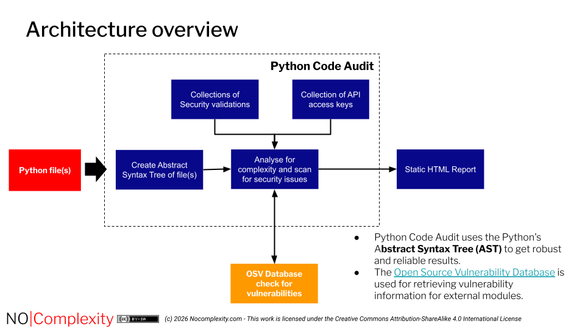
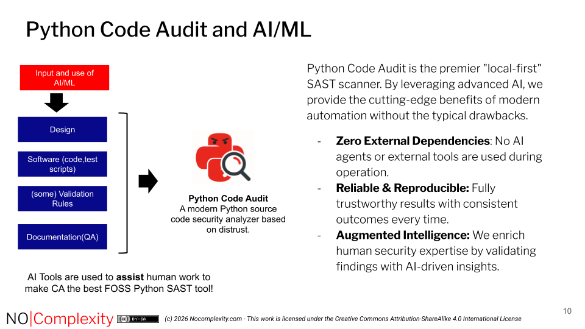

# Architecture Overview

Good security software, especially open-source security software, **should** have a written architecture document. Having an architecture document is vital from a security perspective.

Documenting architecture is crucial for **security, understanding, and maintenance** of the solution by various incidental contributors.

An architecture document:

* Helps developers **understand** how and where to make changes, whether they are new to a project or not.  
* Has a strong emphasis on the ‘**what**’ and provides boundaries for the ‘**how**’ (the implementation). A detailed implementation description is not part of the architecture document.

Within the IT industry, there is continuous debate about what architecture is and what a design is. Being a TOGAF certified practitioner myself, I like to keep things simple and always make sure that the purpose of any document is clear. Therefore, this document is **not a** detailed design; instead, it covers crucial architecture and design decisions that steer the implementation. The code of Python Code Audit itself is **rich in** comments **outlining** detailed implementation choices where needed.

In my opinion, open-source software for security **should** have an open architecture document. This architecture is:

* **Available to** everyone. This architecture document is part of the FOSS product, Python Code Audit, and is released under a Creative Commons licence.  
* Part of an open process in which everyone can participate to improve the architecture. See section [CONTRIBUTE](https://nocomplexity.com/documents/codeaudit/CONTRIBUTE.html).

If you are interested in learning more about architecture—and especially open architecture, see:
- [The Architecture Playbook](https://nocomplexity.com/documents/arplaybook/introduction.html) and
- [Open Architectures do not work: The need for real open Architectures](http://www.slideshare.net/maikelm/open-architectures-do-not-work-the-need-for-real-open-architectures). 

## Architecture Principles

Python Code Audit is built using the following guiding principles:

* **Better safe than sorry:** Python Code Audit adopts a defensive security approach.  
* **Local-first:** No data leakage and no reliance on third-party services. Security and security data should never be outsourced to a ‘black box’ environment.  
* **Simple to use:** Python Code Audit is designed for ease of use by anyone, regardless of experience level.  
* **Simple to extend:** The program must be easy to adapt and build upon for future needs.  
* **Simple to maintain:** We follow [0Complexity design principles](https://nocomplexity.com/documents/0complexity/abstract.html). E.g. simplicity enhances security. This means minimising dependencies and keeping both design and implementation straightforward and transparent.  
* **Transparent:** All code is released under the FOSS (Free and Open Source Software) [GPLv3 licence](https://nocomplexity.com/documents/codeaudit/license.html). Transparency builds trust.  
* **Clear scope:** No tool can do everything well, so we make strong, opinionated choices regarding the functionality we support.

**Implications:**

To maintain this focus, the following are intentionally **out of scope**:

* **No complex checks:** Tasks such as SQL injection detection, TLS certificate validation, or cryptographic misuse analysis are excluded. These areas are difficult to automate reliably and require significant continuous maintenance. We aim to avoid providing a false sense of security.  
* **No multi-language programming support:** Security validation of other languages (such as PHP, C/C++, or Go) is not provided. This requires different expertise; a SAST tool that claims to support many languages is often of limited use.  
* **No linting:** We do not perform PEP8 or code quality checking. Linters are designed for these tasks, but they are generally very weak at identifying security weaknesses. You should never rely on linters for security validation.  
* **No SBOM validation:** Software Composition Analysis (SCA), including SBOM generation and dependency vulnerability checks, is excluded. Validating SBOMs for Python packages can become complex very quickly. We focus on finding weaknesses in the code itself—a distinct aspect of security that offers advantages that SBOM validation cannot provide.
* **No Web Validations:** This Python Code Audit SAST tool prioritises finding weaknesses in core logic and standard library usage. Modern Python frameworks should be secure by design; utilising their standard APIs effectively mitigates risks such as SQL injection. As security flaws frequently arise from bypassing these built-in protections, web applications should be verified using Dynamic Application Security Testing (DAST) and fuzzing to validate crucial business logic.

We focus on delivering a simple, trustworthy security tool that performs its defined tasks exceptionally well—without compromise.

## Design Choices

The following design choices have been made for Python Code Audit:

* **The Python AST library is used for complex validations.**  
  * **Rationale:** As we are creating a Python-specific security checker, using the `ast` module provides **significant** advantages:  
    1. Code is not executed during examination, which is a major benefit when validating potentially malicious code.  
    2. Implementing basic checks using complex regex patterns would make the code and its maintenance unnecessarily difficult.  
    3. Users can add extra validations in a simple, straightforward manner.  
* **Python Code Audit is not designed for identifying weaknesses in web applications.**  
  * **Rationale:** We check Python source code, but do not perform XSS or SQL injection checks. Every Python web application **should** use a battle-tested FOSS framework that prevents these vulnerabilities by design. Testing for these would require building a fuzzer rather than a static code scanner. There are other tools that **must** always be used for validating web applications.  
* **Postpone code performance optimisations until truly necessary.**  
  * **Rationale:** We aim for a loosely coupled architecture of key functions; performance optimisations can be introduced at a later stage if required. In practice, performance optimisations are rarely needed. Most time will be spent by humans analysing results before deciding whether to use a Python package, or making security improvements to their own code. The baseline performance for scanning a 10MB Python package should be the priority.  
  * **Implication:** Ensure that performance optimisations can be applied later to specific functional blocks if they are found to be causing bottlenecks for users.

## Architecture Overview

## Use of AI 

I love new technology. I also advocate for Free and Open Machine Learning/AI. I think FOSS AI/ML is crucial for everyone. See [FOSS AI/ML Guide](https://nocomplexity.com/documents/fossml/abstract.html).

AI/Machine learning is an exciting and powerful technology. The continuous use and growth of AI and machine learning technology opens new opportunities. It also enables opportunities for solving complex problems in a more simple way.

For Python Code Audit we make use of AI/ML capabilities in a secure, safe and most ethical way possible. 

In the view below is outlined how AI/ML technology is used for the development of Python Code Audit.   
Truth is: Most AI tools turned out to be of limited value for real trustworthy cybersecurity aspects. Human knowledge work, especially on design and security aspects is currently still vital for developing and maintaining a trustworthy Python security code analyzer!

