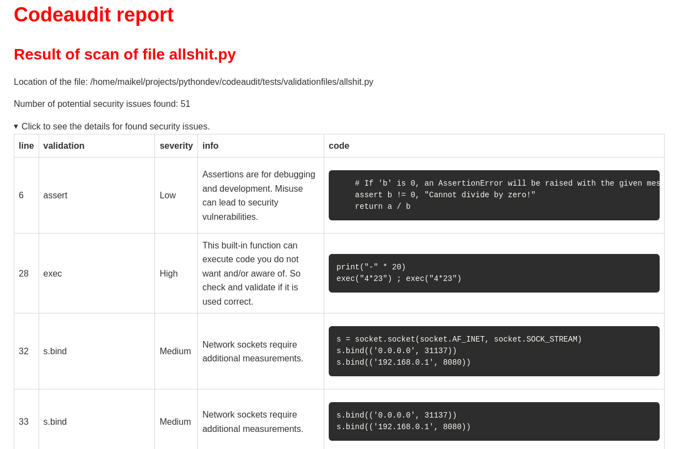

# Command `codeaudit filescan`

The **Python Code Audit** `filescan` command efficiently scans Python files or directories (packages) to identify and report potential security weaknesses.

It produces a report detailing the potential security issues discovered.


See section [validations](checksinformation) for all security checks implemented!


To use the `codescan filescan` feature type in the console:

```
codeaudit filescan <pythonfile|package-name|directory>  [OUTPUTFILE]
```

**Python Code Audit** will create a detailed security scan report based on a single Python file, a local directory or a package on PyPI.org


So the input for `codeaudit filescan`  can be:
* A single Python file;
* A package on PyPI.org: Python Code Audit checks this package on security weakness, so cloning the sources local is not needed!
* A local directory with Python files, e.g. a local package development environment or a cloned package.

If you do not specify [OUTPUTFILE], a HTML output file, a HTML report file is created in the current directory and will be named codeaudit-report.html.

When running `codeaudit filescan` detailed information is determined for a Python file or package based on more than 70 validations implemented.

The `filescan` report lists all identified security weaknesses that could lead to a security vulnerability.

Per line a the in construct that can cause a security risks is shown, along with the relevant code lines where the issue is detected.




:::{note} 
The `codeaudit filescan` command does **NOT** include all directories. This is done on purpose!

The following directories are skipped by default:
* `/docs`
* `/docker`
* `/dist`
* `/tests`
* all directories that start with `.` (dot) or `_` (underscore)
:::


## Example

```
codeaudit filescan ./codeaudit/tests/validationfiles/allshit.py 
Codeaudit report file created!
Check the report file: file:///home/maikel/tmp/codeaudit-report.html
```

Example report of a [codeaudit filescan report](examples/filescan.html) that is generated with the command `codeaudit filescan pythondev/codeaudit/tests/validationfiles/allshit.py`


## Help

```
NAME
    codeaudit filescan - Scans Python source code or PyPI packages for security weaknesses.

SYNOPSIS
    codeaudit filescan INPUT_PATH <flags>

DESCRIPTION
    * A local directory containing Python source code
    * A single local Python file
    * The name of a package hosted on PyPI

    codeaudit filescan <pythonfile|package-name|directory> [reportname.html] [--nosec]

    Based on the input type, the function analyzes the source code for potential
    security issues, generates an HTML report summarizing the findings, and
    writes the report to disk.

    If a PyPI package name is provided, the function downloads the source
    distribution (sdist), extracts it to a temporary directory, scans the
    extracted source code, and cleans up all temporary files after the scan
    completes.

     Examples:

        Scan a local directory and write the report to ``report.html``::

            codeaudit filescan /path/to/custompythonmodule report.html

        Scan a local directory::

            codeaudit filescan /path/to/project

        Scan a single Python file::

            codeaudit filescan myexample.py

        Scan a package hosted on PyPI::

            codeaudit filescan linkaudit

            codeaudit filescan requests

        Specify an output report file::

            codeaudit filescan /path/to/project report.html

        Enable filtering of issues marked with ``#nosec`` or another marker on potential code weaknesses that mitigated or known  ::

            codeaudit filescan myexample.py --nosec

    POSITIONAL ARGUMENTS
    INPUT_PATH
        Path to a local Python file or directory, or the name of a package available on PyPI.

    FLAGS
    -f, --filename=FILENAME
        Default: 'codeaudit-report.html'
        Name (and optional path) of the HTML file to write the scan report to. The filename should use the ``.html`` extension. Defaults to ``DEFAULT_OUTPUT_FILE``.
    -n, --nosec=NOSEC
        Default: False
        Whether to filter out issues marked as reviewed or ignored in the source code. Defaults to ``False``, no filtering.


    NOTES
        You can also use flags syntax for POSITIONAL ARGUMENTS
```