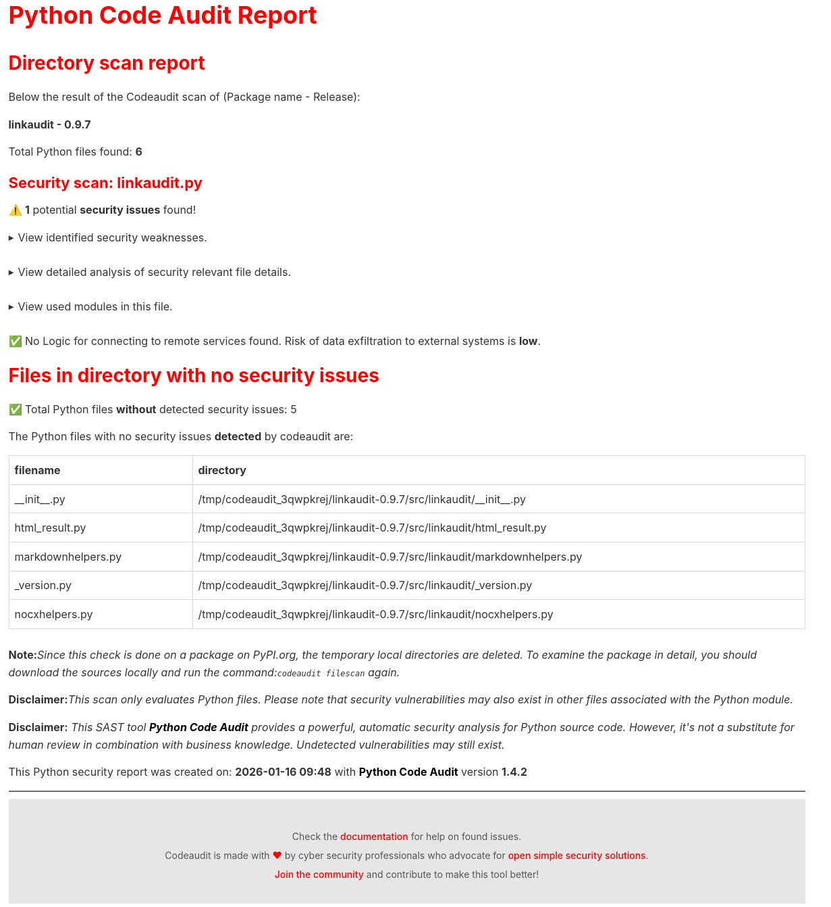
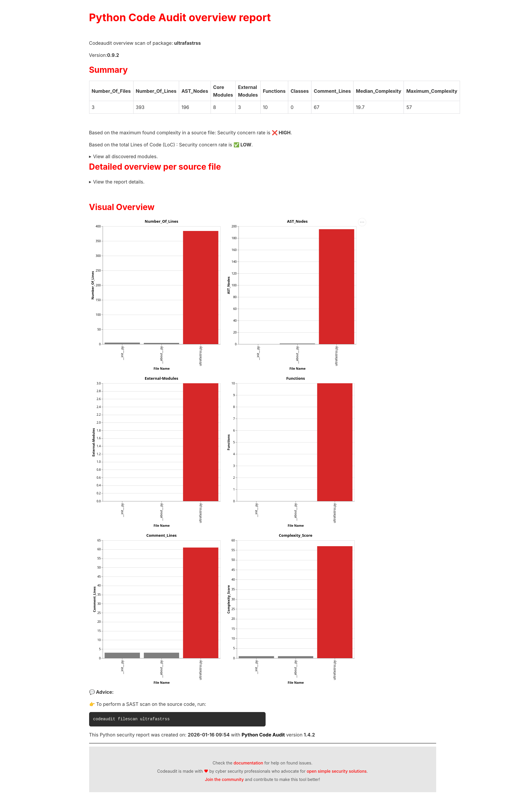
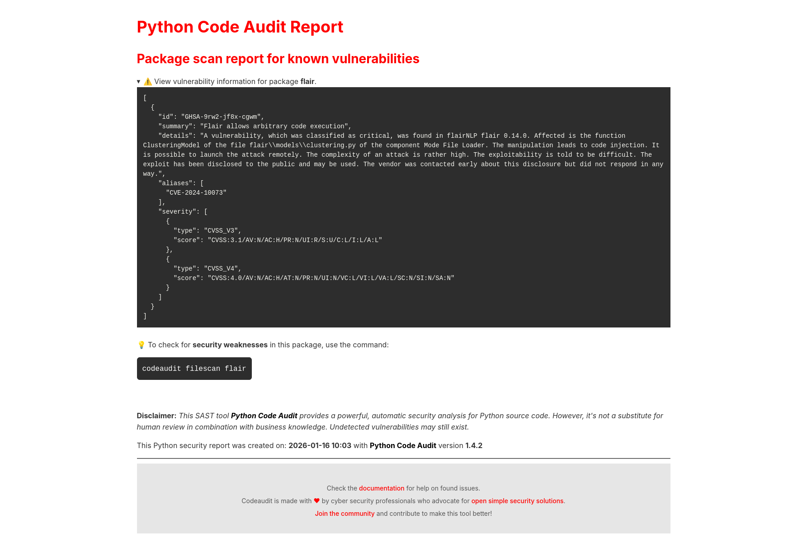

# How to do a SAST test?

Running a Static Application Security Test (SAST) on Python code is essential for ensuring security. It’s also a straightforward [shift-left practice](https://nocomplexity.com/documents/simplifysecurity/intro.html#)  that takes only a fraction of your time yet can help you avoid serious security incidents.


Follow these steps to perform a **static application security test (SAST)** on Python projects using **Python Code Audit**.  

## Use the browser-based version

To access the local browser-based version of Python Code Audit, follow the link below:


```{button-link} https://nocomplexity.com/codeauditapp/dashboardapp.html
:color: danger
Launch webbased version
```

:::{note} 
The browser-based version runs 100% locally; however, please note that not all functionality is available. While you can scan remote packages on PyPI, full features are only accessible via the CLI or a local dashboard version.

The entire application runs within your browser, meaning no server-side processing is involved. For those interested in the technical details: this version is built using WASM(Web Assembly) and is a lightweight version of **Python Code Audit**.
:::


:::{caution} 
The browser-based dashboard version for **Python Code Audit** is currently experimental.
:::


## Install Python Code Audit

[Python Code Audit](https://pypi.org/project/codeaudit/) is an open-source, zero-configuration tool that validates whether your Python code introduces potential security vulnerabilities.  

Install (or update) it with:  

```bash
pip install -U codeaudit
```

:::{tip} 
Even if you already have it installed, it’s recommended to run the command again to ensure you’re using the latest checks and features.  
:::


## Install a Python package

Choose a Python package that is available on PyPI.org. Alternatively, if you are a developer, you can scan your own package or file.


:::{admonition} Install Python programs only from Trusted Sources.
:class: note
This is crucial from a security perspective!

Use only official, managed repositories for installation such as:
- PyPI.org
- conda
- conda-forge
:::


### Do the security scan

On the command line do:
```bash
codeaudit filescanscan <package-name|directory|file> [reportname.html]
```

You can chose a custom report name. But make sure it ends with `.html` since a the report is a static html file.

Example for a security check on a PyPI library for detecting broken links in markdown files:
```bash
codeaudit filescan linkaudit
```

This gives the output:
```
Package: linkaudit exist on PyPI.org!
Now SAST scanning package from the remote location: https://pypi.org/pypi/linkaudit
https://files.pythonhosted.org/packages/8a/5a/e9d4ae4b006ac7fb2faf0d3047ee759d8366b85290ddc0e595bbe290d6c5/linkaudit-0.9.7.tar.gz
0.9.7
Number of files that are checked for security issues:6
Progress: |██████████████████████████████████████████████████| 100.0% Complete

=====================================================================
Code Audit report file created!
Paste the line below directly into your browser bar:
	file:///home/securityproject/example/codeaudit-report.html

=====================================================================

```

The report will look like:



## Generate an Overview Report

Navigate into the cloned repository, then run:  

```bash
codeaudit overview <package-name|directory> [reportname.html]
```

This command provides:  
- Total number of files  
- Total lines of code  
- Imported modules  
- Complexity per file  
- Overall complexity score  

Example for a security check on a PyPI library for RSS parsing:
```bash
codeaudit overview ultrafastrss
```

This gives the output:
```
No local directory with name:ultrafastrss found locally. Checking if package exist on PyPI...
Package: ultrafastrss exist on PyPI.org!
Creating Python Code Audit overview for package:
https://files.pythonhosted.org/packages/c7/45/4f10aaf692e0bc67e8f089a3514804491f3edbacbed2658b191adc3a109b/ultrafastrss-0.9.2.tar.gz

=====================================================================
Code Audit report file created!
Paste the line below directly into your browser bar:
	file:///home/securityproject/example/codeaudit-report.html

=====================================================================

```
The report will look like:



:::{tip} 
📖 More detailed explanations of these metrics can be found in the [Python Code Audit documentation](https://nocomplexity.com/documents/codeaudit/intro.html).  
:::


---

## Check for known vulnerabilities in imported libraries

To check for known vulnerabilities in Python modules and packages you can do:

```
 codeaudit modulescan <pythonfile>|<package> [yourreportname.html]
 ```
To check for known vulnerabilities in a local Python file or a package on PyPI.org

Example, to check for known vulnerabilities in imported libraries in the Flair NLP package:
```bash
codeaudit modulescan flair
```


The report will look like:


:::{tip} 
To analyze this package for potential security weaknesses, run:

`codeaudit filescan <file|package-name>`

**Most real-world vulnerabilities and insecure coding practices are never formally disclosed or assigned a CVE**. As a result, source code analysis provides far greater security insight than relying solely on known vulnerability databases. Scanning the code itself helps uncover hidden risks, unsafe patterns, and trust violations that would otherwise remain undetected.

:::


## Review the Security Report

The **Python Code Audit** security scan generates a static **HTML report** in the directory where you ran the command.  

Example output path:  

```
file:///home/usainbolt/testdir/codeaudit-report.html
```

- On **Linux**, you can usually click the link directly in the terminal.  
- On **Windows**, you may need to manually copy and paste the file path into your browser.  


✅ You now have a detailed static application security test (SAST) report highlighting potential security issues in your Python code. 


:::{hint} 
If you need assistance with solving or want short and clear advice on possible security risks for your context:

Get expert security advice  from one of our [sponsors](sponsors)!
:::