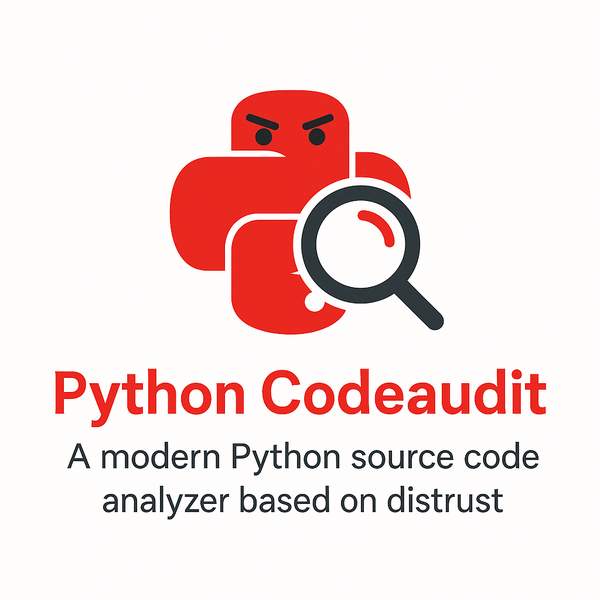

# Introduction

Python Code Audit is a Static Application Security Testing (SAST) tool to find **potential security issues** in Python source files.

Python Code Audit is designed to be:
* Simple to use.
* Simple to extend for various use cases.
* Powerful to determine *potential* security issues within Python code.

:::{danger} 
Using Python Code Audit you will give you direct insight in **potential security issues** in the Python programs you use.

Make sure you want to know this!
:::

## Features

:::{admonition} Python Code Audit has the following features:
:class: tip

* **Vulnerability Detection**: Identifies potential security issues in Python files. Crucial to check trust in Python modules and essential for security research.

+++

* **Complexity & Statistics**: Reports security-relevant complexity statistics using a fast, lightweight [cyclomatic complexity](https://en.wikipedia.org/wiki/Cyclomatic_complexity) count by using Python AST.

+++

* **Module Usage & External Vulnerabilities**: Detects used modules and reports known vulnerabilities in used modules.

+++
* **Inline Issue Reporting**: Shows potential security issues with line numbers and crucial code snippets. 

+++
* **HTML Reports**: All output is saved in simple, static HTML reports. Viewable in any browser.

:::

## Background

There are not many good and maintained FOSS SAST tools for Python available. A well known Python SAST tool is `Bandit`. However `Bandit` is limited in identifying security issues and has constrains that makes the use not simple. `Bandit` lacks crucial Python code validations from a security perspective!

:::{note}
This `codeaudit` tool is designed to be complete, fast and simple and easy to maintain library that can be extended for all needs.
:::

